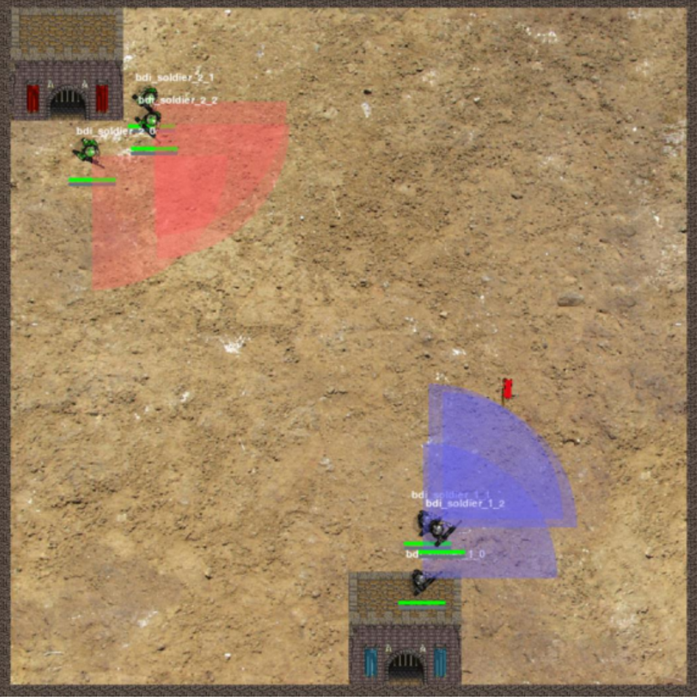

# Proyecto de Agentes Autónomos para PyGOMAS: Capturar la Bandera

Este proyecto se centra en el diseño y desarrollo de un sistema multi-agente inteligente. El objetivo principal es implementar tres agentes autónomos capaces de percibir su entorno, tomar decisiones tácticas en tiempo real y cooperar estratégicamente para competir en partidas de "capturar la bandera" dentro del entorno de simulación pyGOMAS.

  
   
  <em>Un vistazo al entorno PyGomas</em>

## Descripción del Proyecto

Nuestros agentes deben percibir el entorno para construir un conjunto de creencias y tomar decisiones basadas en comportamientos similares a BDI (Belief-Desire-Intention) empleando el lenguaje AgentSpeak. El objetivo es conseguir la victoria para nuestro equipo en cada partida, cumpliendo la meta correspondiente a su bando:
- **Equipo Allied (Atacante):** Localizar y capturar la bandera enemiga antes del límite de tiempo.
- **Equipo Axis (Defensor):** Proteger la bandera asegurando la zona e impidiendo que el equipo oponente la capture.

## Roles Implementados y Comportamiento Estratégico

El desarrollo contempla la implementación de tres roles definidos, cada uno con habilidades y heurísticas de toma de decisiones particulares para cooperar en equipo:

### 1. Soldado (`bdisoldier.asl`)
* **Habilidad especial:** Capacidad de ataque superior (inflige el doble de daño).
* **Análisis de riesgos:** Antes de entablar combate, el agente evalúa su estado de salud frente al del enemigo. Si la probabilidad de supervivencia es baja, activa un estado de evasión y retirada hacia una zona segura.
* **Supervivencia y Suministros:** Monitoriza constantemente sus niveles de salud y munición (ej. recurriendo a paquetes de salud si su nivel desciende por debajo de 30 sobre 100). Es capaz de memorizar la ubicación del último paquete médico avistado y acudir a él en caso de necesidad.

### 2. Médico (`bdimedic.asl`)
* **Habilidad especial:** Generación de paquetes de medicina (`medpacks`) para recuperar la salud de los agentes aliados.
* **Fortificación defensiva (Axis):** Establece una ruta de patrulla defensiva (`control_points`) proporcionando suministros médicos de forma preventiva (ej. usando la acción `.cure`) y fortificando las áreas clave.
* **Ruta logística (Allied):** Acompaña al equipo atacante creando puntos de control orientados hacia el objetivo, garantizando apoyo médico sostenido durante las acometidas.
* **Evaluación de combate:** Cuenta con lógicas condicionales para determinar si posee una ventaja táctica sobre tropas enemigas, pudiendo evitar refriegas innecesarias contra soldados en inferioridad de condiciones.

### 3. Operador de Campo (`bdifieldop.asl`)
* **Habilidad especial:** Provisión de paquetes de munición (`ammopacks`) para asegurar la autonomía operativa del equipo.
* **Patrullas de reabastecimiento:** Al igual que el médico, establece rutas defensivas u ofensivas, utilizando su habilidad de recarga (`.reload`) en puntos estratégicos.
* **Gestión de recursos:** Responde a la baja de munición reabasteciendo su ruta e interceptando puntos críticos del combate. Evalúa el estado del enemigo priorizando atacar a objetivos debilitados o casi eliminados (vida inferior a 20).

## Reglas y Condiciones del Entorno

Para garantizar la solidez e interoperabilidad de los agentes, los modelos están diseñados para operar bajo las siguientes condiciones dinámicas en pyGOMAS:

* **Mapas:** Entorno de despliegue aleatorio predefinido por los recursos de pyGOMAS (ej. `map_01`, `map_arena`, `mine`).
* **Composición de equipos:** Número de agentes por escuadrón variable entre 3 y 8.
* **Distribución de roles:** Asignación de roles aleatoria, asegurando la intervención de al menos un agente representante de cada uno de los tres roles descritos.
* **Duración:** Tiempo máximo de ejecución fijado en 5 minutos por partida.
* **Interoperabilidad:** Al iniciarse la partida, los agentes operarán en un ecosistema compartido pudiendo estar agrupados aleatoriamente con agentes desarrollados por diferentes equipos.

---

Copyright (c) 2026 Jesús Peñaranda, Àngel Domínguez, Gabriel Alegre \
All rights reserved. This code may not be used, copied, modified, or distributed without explicit permission. \
This repository is intended for portfolio and evaluation purposes only.

